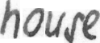
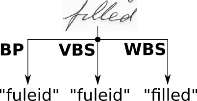
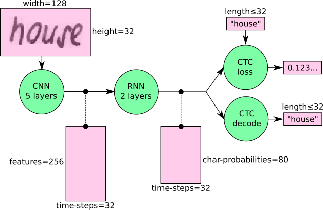
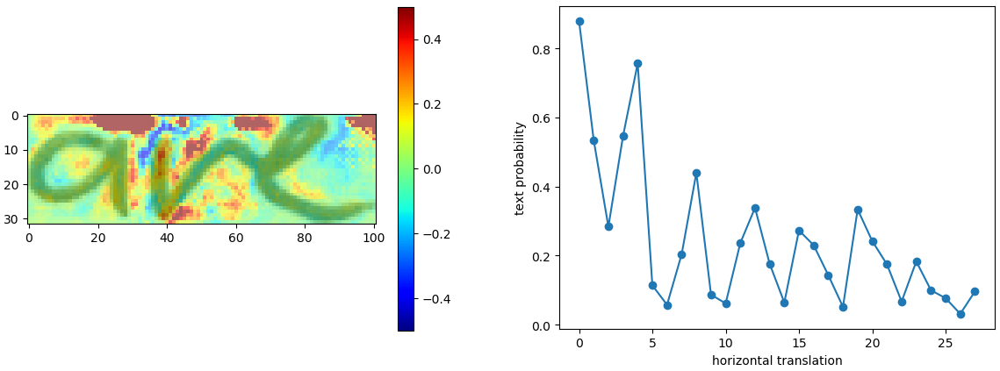

# Handwritten Text Recognition with TensorFlow

Handwritten Text Recognition (HTR) system implemented with TensorFlow (TF) and trained on the IAM off-line HTR dataset.
This Neural Network (NN) model recognizes the text contained in the images of segmented words as shown in the illustration below.
As these word-images are smaller than images of complete text-lines, the NN can be kept small and training on the CPU is feasible.
3/4 of the words from the validation-set are correctly recognized and the character error rate is around 10%.
I will give some hints how to extend the model in case you need larger input-images (e.g. to recognize text-lines) or want better recognition accuracy.


## Run demo

Go to the `model/` directory and unzip the file `model.zip` (pre-trained on the IAM dataset).
Take care that the unzipped files are placed directly into the `model/` directory and not some subdirectory created by the unzip-program.
Afterwards, go to the `src/` directory and run `python main.py`.
The input image and the expected output is shown below.



```
> python main.py
Validation character error rate of saved model: 10.624916%
Init with stored values from ../model/snapshot-38
Recognized: "little"
Probability: 0.96625507
```

Tested with:

* Python 2 and Python 3
* TF 1.3, 1.10 and 1.12
* Ubuntu 16.04 and Windows 7


## Command line arguments

* `--train`: train the NN, details see below.
* `--validate`: validate the NN, details see below.
* `--beamsearch`: use vanilla beam search decoding (better, but slower) instead of best path decoding.
* `--wordbeamsearch`: use word beam search decoding (only outputs words contained in a dictionary) instead of best path decoding. This is a custom TF operation and must be compiled from source, more information see corresponding section below. It should **not** be used when training the NN.

If neither `--train` nor `--validate` is specified, the NN infers the text from the test image (`data/test.png`).
Two examples: if you want to infer using beam search, execute `python main.py --beamsearch`, while you have to execute `python main.py --train --beamsearch` if you want to train the NN and do the validation using beam search.


## Integrate word beam search decoding

Besides the two decoders shipped with TF, it is possible to use word beam search decoding \[4\].
Using this decoder, words are constrained to those contained in a dictionary, but arbitrary non-word character strings (numbers, punctuation marks) can still be recognized.
The following illustration shows a sample for which word beam search is able to recognize the correct text, while the other decoders fail.



Follow these instructions to integrate word beam search decoding:

1. Clone repository [CTCWordBeamSearch](https://github.com/githubharald/CTCWordBeamSearch).
2. Compile custom TF operation (follow instructions given in README).
3. Copy binary `TFWordBeamSearch.so` from the CTCWordBeamSearch repository to the `src/` directory of the SimpleHTR repository.

Word beam search can now be enabled by setting the corresponding command line argument.
The dictionary is created (in training and validation mode) by using all words contained in the IAM dataset (i.e. also including words from validation set) and is saved into the file `data/corpus.txt`.
Further, the (manually created) list of word-characters can be found in the file `model/wordCharList.txt`.
Beam width is set to 50 to conform with the beam width of vanilla beam search decoding.

Using this configuration, a character error rate of 8% and a word accuracy of 84% is achieved.

## Train model 

### IAM dataset

The data-loader expects the IAM dataset \[5\] (or any other dataset that is compatible with it) in the `data/` directory.
Follow these instructions to get the dataset:

1. Register for free at this [website](http://www.fki.inf.unibe.ch/databases/iam-handwriting-database).
2. Download `words/words.tgz`.
3. Download `ascii/words.txt`.
4. Put `words.txt` into the `data/` directory.
5. Create the directory `data/words/`.
6. Put the content (directories `a01`, `a02`, ...) of `words.tgz` into `data/words/`.
7. Go to `data/` and run `python checkDirs.py` for a rough check if everything is ok.

If you want to train the model from scratch, delete the files contained in the `model/` directory.
Otherwise, the parameters are loaded from the last model-snapshot before training begins.
Then, go to the `src/` directory and execute `python main.py --train`.
After each epoch of training, validation is done on a validation set (the dataset is split into 95% of the samples used for training and 5% for validation as defined in the class `DataLoader`).
If you only want to do validation given a trained NN, execute `python main.py --validate`.
Training on the CPU takes 18 hours on my system (VM, Ubuntu 16.04, 8GB of RAM and 4 cores running at 3.9GHz).
The expected output is shown below.

```
> python main.py --train
Init with new values
Epoch: 1
Train NN
Batch: 1 / 500 Loss: 130.354
Batch: 2 / 500 Loss: 66.6619
Batch: 3 / 500 Loss: 36.0154
Batch: 4 / 500 Loss: 24.5898
Batch: 5 / 500 Loss: 20.1845
Batch: 6 / 500 Loss: 19.2857
Batch: 7 / 500 Loss: 18.3493
...

Validate NN
Batch: 1 / 115
Ground truth -> Recognized
[OK] "," -> ","
[ERR:1] "Di" -> "D"
[OK] "," -> ","
[OK] """ -> """
[OK] "he" -> "he"
[OK] "told" -> "told"
[ERR:2] "her" -> "nor"
...
Character error rate: 13.956289%. Word accuracy: 67.721739%.
```

### Other datasets

Either convert your dataset to the IAM format (look at `words.txt` and the corresponding directory structure) or change the class `DataLoader` according to your dataset format.
More information can be found in [this article](https://medium.com/@harald_scheidl/27648fb18519).


## Information about model

### Overview

The model \[1\] is a stripped-down version of the HTR system I implemented for my thesis \[2\]\[3\].
What remains is what I think is the bare minimum to recognize text with an acceptable accuracy.
The implementation only depends on numpy, cv2 and tensorflow imports.
It consists of 5 CNN layers, 2 RNN (LSTM) layers and the CTC loss and decoding layer.
The illustration below gives an overview of the NN (green: operations, pink: data flowing through NN) and here follows a short description:

* The input image is a gray-value image and has a size of 128x32
* 5 CNN layers map the input image to a feature sequence of size 32x256
* 2 LSTM layers with 256 units propagate information through the sequence and map the sequence to a matrix of size 32x80. Each matrix-element represents a score for one of the 80 characters at one of the 32 time-steps
* The CTC layer either calculates the loss value given the matrix and the ground-truth text (when training), or it decodes the matrix to the final text with best path decoding or beam search decoding (when inferring)
* Batch size is set to 50




### Improve accuracy

74% of the words from the IAM dataset are correctly recognized by the NN when using vanilla beam search decoding.
If you need a better accuracy, here are some ideas how to improve it \[2\]:

* Data augmentation: increase dataset-size by applying further (random) transformations to the input images. At the moment, only random distortions are performed.
* Remove cursive writing style in the input images (see [DeslantImg](https://github.com/githubharald/DeslantImg)).
* Increase input size (if input of NN is large enough, complete text-lines can be used, see [lamhoangtung/LineHTR](https://github.com/lamhoangtung/LineHTR)).
* Add more CNN layers ([see discussion](https://github.com/githubharald/SimpleHTR/issues/38)).
* Replace LSTM by 2D-LSTM.
* Replace optimizer: Adam improves the accuracy, however, the number of training epochs increases ([see discussion](https://github.com/githubharald/SimpleHTR/issues/27)).
* Decoder: use token passing or word beam search decoding \[4\] (see [CTCWordBeamSearch](https://github.com/githubharald/CTCWordBeamSearch)) to constrain the output to dictionary words.
* Text correction: if the recognized word is not contained in a dictionary, search for the most similar one.

### Analyze model

Run `python analyze.py` with the following arguments to analyze the image file `data/analyze.png` with the ground-truth text "are":

* `--relevance`: compute the pixel relevance for the correct prediction.
* `--invariance`: check if the model is invariant to horizontal translations of the text.
* No argument provided: show the results.

Results are shown in the plots below.
The pixel relevance (left) shows how a pixel influences the score for the correct class.
Red pixels vote for the correct class, while blue pixels vote against the correct class.
It can be seen that the white space above vertical lines in images is important for the classifier to decide against the "i" character with its superscript dot.
Draw a dot above the "a" (red region in plot) and you will get "aive" instead of "are".

The second plot (right) shows how the probability of the ground-truth text changes when the text is shifted to the right.
As can be seen, the model is not translation invariant, as all training images from IAM are left-aligned.
Adding data augmentation which uses random text-alignments can improve the translation invariance of the model.
More information can be found in [this article](https://towardsdatascience.com/6c04864b8a98).




## FAQ

1. I get the error message "Exception: No saved model found in: ... ": unzip the file `model/model.zip`. All files contained must be placed directly into the `model/` directory and **not** in some subdirectory created by the unzip-program.
2. I get the error message "... TFWordBeamSearch.so: cannot open shared object file: No such file or directory": if you want to use word beam search decoding, you have to compile the custom TF operation from source.
3. I get the error message "... ModuleNotFoundError: No module named 'editdistance'": you have to install the mentioned module by executing `pip install editdistance`.
4. Where can I find the file `words.txt` of the IAM dataset: it is located in the subfolder `ascii` of the IAM website.
5. I want to recognize text of line (or sentence) images: this is not possible with the provided model. The size of the input image is too small. For more information read [this article](https://medium.com/@harald_scheidl/27648fb18519) or have a look at the [lamhoangtung/LineHTR](https://github.com/lamhoangtung/LineHTR) repository.
6. I need a confidence score for the recognized text: after recognizing the text, you can calculate the loss value for the NN output and the recognized text. The loss simply is the negative logarithm of the score. See [this article](https://medium.com/@harald_scheidl/27648fb18519).
7. I use a custom image of handwritten text, but the NN outputs a wrong result: the NN is trained on the IAM dataset. The NN not only learns to recognize text, but it also learns properties of the dataset-images. Some obvious properties of the IAM dataset are: text is tightly cropped, contrast is very high, most of the characters are lower-case. Either you preprocess your image to look like an IAM image, or you train the NN on your own dataset. See [this article](https://medium.com/@harald_scheidl/27648fb18519).
8. I get an error when running the script more than once from an interactive Python session: do **not** call function `main()` in file `main.py` from an interactive session, as the TF computation graph is created multiple times when calling `main()` multiple times. Run the script by executing `python main.py` instead.


## References

\[1\] [Build a Handwritten Text Recognition System using TensorFlow](https://towardsdatascience.com/2326a3487cd5)

\[2\] [Scheidl - Handwritten Text Recognition in Historical Documents](https://repositum.tuwien.ac.at/obvutwhs/download/pdf/2874742)

\[3\] [Shi - An End-to-End Trainable Neural Network for Image-based Sequence Recognition and Its Application to Scene Text Recognition](https://arxiv.org/pdf/1507.05717.pdf)

\[4\] [Scheidl - Word Beam Search: A Connectionist Temporal Classification Decoding Algorithm](https://repositum.tuwien.ac.at/obvutwoa/download/pdf/2774578)

\[5\] [Marti - The IAM-database: an English sentence database for offline handwriting recognition](http://www.fki.inf.unibe.ch/databases/iam-handwriting-database)
