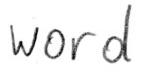

# Handwritten Text Recognition with TensorFlow

* **Update 2021/2: recognize text on line level (multiple words)**
* **Update 2021/1: more robust model, faster dataloader, word beam search decoder also available for Windows**
* **Update 2020: code is compatible with TF2**


Handwritten Text Recognition (HTR) system implemented with TensorFlow (TF) and trained on the IAM off-line HTR dataset.
The model takes **images of single words or text lines (multiple words) as input** and **outputs the recognized text**.
3/4 of the words from the validation-set are correctly recognized, and the character error rate is around 10%.


## Run demo

* Download one of the pretrained models
  * [Model trained on word images](https://www.dropbox.com/s/mya8hw6jyzqm0a3/word-model.zip?dl=1): 
    only handles single words per image, but gives better results on the IAM word dataset
  * [Model trained on text line images](https://www.dropbox.com/s/7xwkcilho10rthn/line-model.zip?dl=1):
    can handle multiple words in one image
* Put the contents of the downloaded zip-file into the `model` directory of the repository  
* Go to the `src` directory 
* Run inference code:
  * Execute `python main.py` to run the model on an image of a word
  * Execute `python main.py --img_file ../data/line.png` to run the model on an image of a text line

The input images, and the expected outputs are shown below when the text line model is used.


```
> python main.py
Init with stored values from ../model/snapshot-13
Recognized: "word"
Probability: 0.9806370139122009
```


```
> python main.py --img_file ../data/line.png
Init with stored values from ../model/snapshot-13
Recognized: "or work on line level"
Probability: 0.6674373149871826
```

## Command line arguments
* `--mode`: select between "train", "validate" and "infer". Defaults to "infer".
* `--decoder`: select from CTC decoders "bestpath", "beamsearch" and "wordbeamsearch". Defaults to "bestpath". For option "wordbeamsearch" see details below.
* `--batch_size`: batch size.
* `--data_dir`: directory containing IAM dataset (with subdirectories `img` and `gt`).
* `--fast`: use LMDB to load images faster.
* `--line_mode`: train reading text lines instead of single words.
* `--img_file`: image that is used for inference.
* `--dump`: dumps the output of the NN to CSV file(s) saved in the `dump` folder. Can be used as input for the [CTCDecoder](https://github.com/githubharald/CTCDecoder).


## Integrate word beam search decoding

The [word beam search decoder](https://repositum.tuwien.ac.at/obvutwoa/download/pdf/2774578) can be used instead of the two decoders shipped with TF.
Words are constrained to those contained in a dictionary, but arbitrary non-word character strings (numbers, punctuation marks) can still be recognized.
The following illustration shows a sample for which word beam search is able to recognize the correct text, while the other decoders fail.


Follow these instructions to integrate word beam search decoding:

1. Clone repository [CTCWordBeamSearch](https://github.com/githubharald/CTCWordBeamSearch)
2. Compile and install by running `pip install .` at the root level of the CTCWordBeamSearch repository
3. Specify the command line option `--decoder wordbeamsearch` when executing `main.py` to actually use the decoder

The dictionary is automatically created in training and validation mode by using all words contained in the IAM dataset (i.e. also including words from validation set) and is saved into the file `data/corpus.txt`.
Further, the manually created list of word-characters can be found in the file `model/wordCharList.txt`.
Beam width is set to 50 to conform with the beam width of vanilla beam search decoding.


## Train model on IAM dataset

### Prepare dataset
Follow these instructions to get the IAM dataset:

* Register for free at this [website](http://www.fki.inf.unibe.ch/databases/iam-handwriting-database)
* Download `words/words.tgz`
* Download `ascii/words.txt`
* Create a directory for the dataset on your disk, and create two subdirectories: `img` and `gt`
* Put `words.txt` into the `gt` directory
* Put the content (directories `a01`, `a02`, ...) of `words.tgz` into the `img` directory

### Run training

* Delete files from `model` directory if you want to train from scratch
* Go to the `src` directory and execute `python main.py --mode train --data_dir path/to/IAM`
* The IAM dataset is split into 95% training data and 5% validation data  
* If the option `--line_mode` is specified, 
  the model is trained on text line images created by combining multiple word images into one  
* Training stops after a fixed number of epochs without improvement

The pretrained word model was trained with this command on a GTX 1050 Ti:
```
python main.py --mode train --fast --data_dir path/to/iam  --batch_size 500 --early_stopping 15
```

And the line model with:
```
python main.py --mode train --fast --data_dir path/to/iam  --batch_size 250 --early_stopping 10
```


### Fast image loading
Loading and decoding the png image files from the disk is the bottleneck even when using only a small GPU.
The database LMDB is used to speed up image loading:
* Go to the `src` directory and run `create_lmdb.py --data_dir path/to/iam` with the IAM data directory specified
* A subfolder `lmdb` is created in the IAM data directory containing the LMDB files
* When training the model, add the command line option `--fast`

The dataset should be located on an SSD drive.
Using the `--fast` option and a GTX 1050 Ti training on single words takes around 3h with a batch size of 500.
Training on text lines takes a bit longer.


## Information about model

The model is a stripped-down version of the HTR system I implemented for [my thesis]((https://repositum.tuwien.ac.at/obvutwhs/download/pdf/2874742)).
What remains is the bare minimum to recognize text with an acceptable accuracy.
It consists of 5 CNN layers, 2 RNN (LSTM) layers and the CTC loss and decoding layer.
For more details see this [Medium article](https://towardsdatascience.com/2326a3487cd5).


## References
* [Build a Handwritten Text Recognition System using TensorFlow](https://towardsdatascience.com/2326a3487cd5)
* [Scheidl - Handwritten Text Recognition in Historical Documents](https://repositum.tuwien.ac.at/obvutwhs/download/pdf/2874742)
* [Scheidl - Word Beam Search: A Connectionist Temporal Classification Decoding Algorithm](https://repositum.tuwien.ac.at/obvutwoa/download/pdf/2774578)

